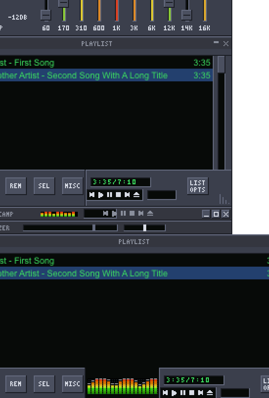
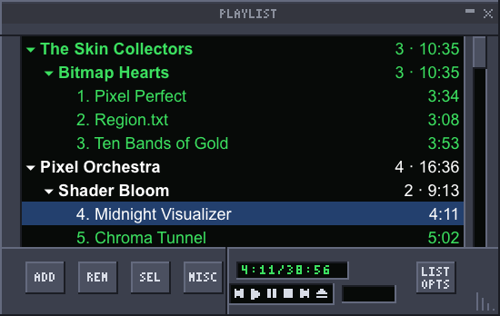
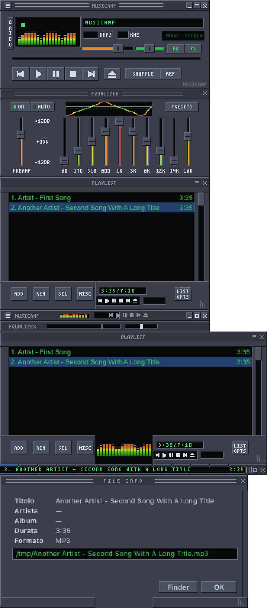
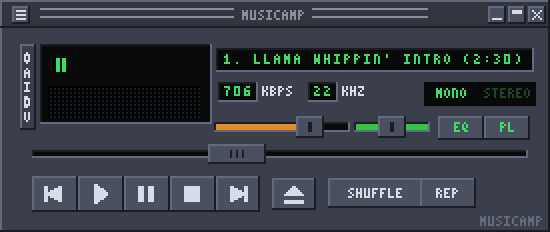
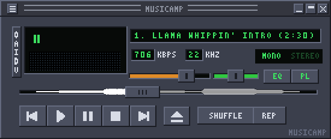
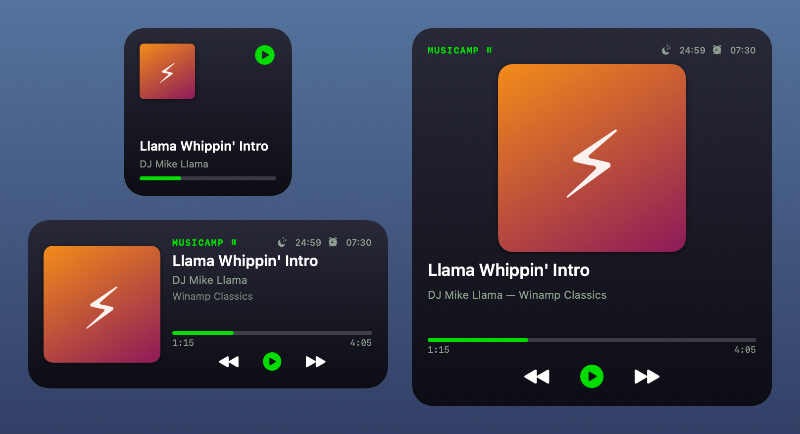
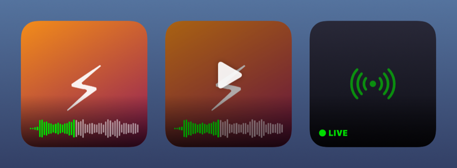
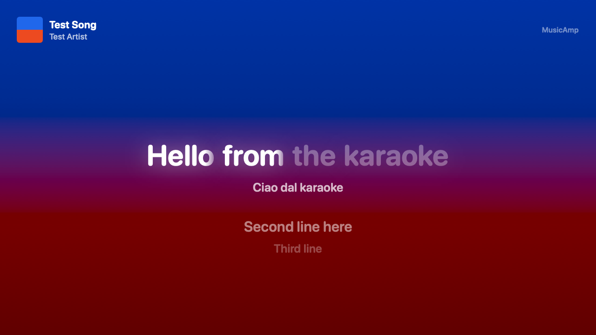
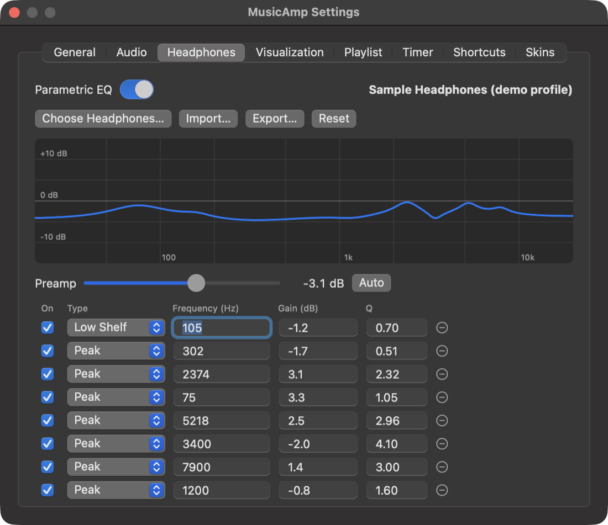

# MusicAmp

Un player audio minimale e nativo per macOS, compatibile con le skin classiche di Winamp 2.x (`.wsz`), con visualizzazioni Milkdrop su Metal.



## Funzioni principali

- **Skin di Winamp 2.x pixel per pixel:**
  - finestra principale, equalizzatore, playlist e le loro modalità ridotte;
  - finestre secondarie con la grafica della skin, `region.txt`, cursori `.cur`/`.ani`, font della skin;
  - [skin Retina](docs/skin-retina.md) opzionali, con bitmap `@2x` nello stesso `.wsz`;
  - barra di avanzamento a forma d'onda opzionale, disegnata nella barra della skin con i suoi colori.
- **Audio:**
  - gapless, crossfade, ReplayGain (dai tag o misurato con EBU R128);
  - transizioni intelligenti: saltano i silenzi tra album diversi e non sfumano mai dentro un album;
  - rimozione della voce per il karaoke (⌥⌘V), che tiene bassi e strumenti;
  - EQ a 10 bande con i preset Winamp `.eqf`/`.q1`, più EQ parametrico con i profili [AutoEq](https://github.com/jaakkopasanen/AutoEq) di circa 8.850 cuffie e crossfeed per le cuffie;
  - uscita bit-perfect, con il dispositivo portato alla frequenza di ogni brano;
  - album in un solo file con `.cue`, divisi in tracce;
  - timer di spegnimento e sveglia, con dissolvenze;
  - formati extra (Ogg, Opus, APE, WavPack, Musepack, WMA, DSD…) con FFmpeg già incluso;
  - AirPlay e scelta dell'uscita.
- **Altoparlanti (Beta):** [più casse AirPlay insieme, Chromecast, Sonos e UPnP/DLNA](docs/sorgenti-e-uscite.md), in FLAC senza perdita o AAC 320 kb/s, dopo gli EQ. Pausa e volume vengono inoltrati ai dispositivi, e la TV mostra il karaoke.
- **Radio internet** Icecast/SHOUTcast e HLS, con client nativo e catalogo radio-browser.info.
- **Podcast:** ricerca, RSS, OPML, download, velocità e intonazione, Voice Boost e silenzi accorciati, ripresa dal punto salvato negli audiolibri.
- **Testi** sincronizzati (LRCLIB, `.lrc`, tag), tradotti riga per riga sul Mac, e **karaoke** a schermo intero con le parole evidenziate una alla volta, anche sulla TV tramite Chromecast.
- **Milkdrop** su Metal:
  - preset `.milk` di Milkdrop 1 e 2;
  - gli shader HLSL di Milkdrop 2 sono tradotti in Metal: compila il 99,9% della raccolta "cream of the crop" di projectM.
- **Playlist** piatta o ad albero artista → album → brano, con ricerca istantanea (⌘F), coda, Jump to file e libreria di Musica.
- **Intelligenza artificiale sul Mac** (Apple Intelligence, niente esce dal computer):
  - testi sincronizzati generati dall'audio per il karaoke;
  - podcast trascritti, con capitoli, riassunto, pubblicità saltate da sole e ricerca nel parlato;
  - playlist intelligenti descritte a parole;
  - umore e strumenti di ogni brano in Sonic Mix;
  - riordino dei tag disordinati. Vedi [docs/ai.md](docs/ai.md).
- **Sonic Mix:** analisi sul Mac di timbro, tonalità, tempo ed energia, per una radio di brani simili o un viaggio graduale da un brano all'altro.
- **Ascolti, voti e playlist intelligenti:** conteggio degli ascolti, voti a stelle salvati anche nei tag MP3/FLAC, playlist a regole come in iTunes, anche per genere, anno, BPM e tonalità compatibile.
- **Editor dei tag** per uno o più file (MP3, FLAC, M4A): titolo, artista, album, anno, genere, traccia e disco, commento e copertina, con numerazione automatica e ricerca di tag e copertine su MusicBrainz / Cover Art Archive.
- **Vista copertina** grande con comandi e la striscia degli album della playlist, anche a schermo intero.
- **macOS:**
  - tasti multimediali e "In riproduzione", mini controller nella barra dei menu, notifiche;
  - icona del Dock dinamica con copertina e forma d'onda; chiudendo il player la musica continua e l'icona del Dock diventa il telecomando (clic = play/pausa, clic destro = comandi); in alternativa un Mini Tile flottante;
  - VoiceOver e scorciatoie globali;
  - azioni per Comandi rapidi e Siri, widget "Now Playing" per scrivania e Centro Notifiche, URL `musicamp://`;
  - finestre agganciate viste come una sola in Mission Control;
  - interfaccia in inglese o in italiano (Impostazioni → Generali → Lingua).

| Playlist ad albero | Finestre secondarie con la grafica della skin |
| --- | --- |
|  |  |

### Barra di avanzamento a forma d'onda

Opzionale (Impostazioni → Visualization): l'onda del brano è disegnata dentro la barra della skin, con i colori presi dal suo `viscolor.txt`. Spenta, la skin resta identica.

| Barra classica | Con la forma d'onda |
| --- | --- |
|  |  |

### Widget





### Altoparlanti (Beta)

Controlli → Altoparlanti manda la musica a casse AirPlay 2 (anche più di una, sincronizzate), Chromecast, Sonos e UPnP/DLNA trovati sulla rete. Lo stream parte dopo equalizzatori e crossfeed, in FLAC a 24 bit o in AAC 320 kb/s. Con il pulsante 🎤 il Chromecast riceve un video karaoke: testo e audio viaggiano nello stesso stream e restano sempre sincronizzati.



### EQ parametrico per cuffie



### Editor dei tag


### Milkdrop

| | |
| --- | --- |
|  |  |
|  |  |

*Preset inclusi in MusicAmp, renderizzati con audio di prova. Le immagini dell'interfaccia usano la skin predefinita di MusicAmp, brani e profili di prova.*

## Installazione

Scarica il DMG dall'ultima [release](https://github.com/nicolorisitano82/MusicAmp/releases), aprilo e trascina **MusicAmp** in Applicazioni. Serve **macOS 26** su un Mac con **Apple Silicon**. Le funzioni di intelligenza artificiale richiedono Apple Intelligence attivo.

L'app non è ancora firmata con un Developer ID né notarizzata, quindi alla prima apertura macOS la blocca. Aprila col **tasto destro → Apri**, oppure da **Impostazioni di Sistema → Privacy e sicurezza → Apri comunque**.

Le skin non sono incluse: trascina un file `.wsz` sul player per caricarlo. I preset Milkdrop vanno in `~/Library/Application Support/MusicAmp/Milkdrop`; 8 sono già inclusi.

## Primi passi

- **Widget:** apri MusicAmp almeno una volta, poi clic destro sulla scrivania → **Modifica widget…**, cerca **MusicAmp** e trascina la misura che vuoi. Per il Centro Notifiche: clic su data e ora → **Modifica widget**.
- **Comandi rapidi e Siri:** le azioni di MusicAmp sono già nell'app Comandi rapidi (cerca "MusicAmp"); per esempio "Play or pause MusicAmp" o "Play Top Rated in MusicAmp".
- **Da script o link:** `open -g musicamp://next`, `musicamp://volume?level=40`, `musicamp://sleep?minutes=30`. Elenco completo in [docs/sistema.md](docs/sistema.md).
- **Timer e sveglia:** Impostazioni → Timer, oppure Controlli → Sleep Timer and Alarm.
- **Voti e playlist intelligenti:** ⌥⌘1–5 per votare il brano in corso, clic destro nella playlist per i brani selezionati, ⌥⌘S per le playlist intelligenti.
- **Profilo per le tue cuffie:** Impostazioni → Headphones → Choose Headphones….

## Compilare

```bash
./build-app.sh
```

Crea `build/MusicAmp.app` (Apple Silicon) e `build/MusicAmp-<versione>.dmg`. Servono Swift 6, macOS 26 e Xcode installato (per i metadati di Comandi rapidi e widget); non c'è un progetto Xcode. La prima build scarica e compila FFmpeg dai sorgenti ufficiali (circa un minuto).

## Test

```bash
Scripts/test-all.sh
```

Esegue tutte le suite (audio a volume zero, rete solo se disponibile) e stampa un riepilogo. Con `--package` controlla anche l'app pacchettizzata. Dettagli in [docs/strumenti-debug.md](docs/strumenti-debug.md).

## Documentazione

La [documentazione tecnica](docs/README.md) copre architettura, formato delle skin classiche e Retina, motore audio, tag, [ascolti e playlist intelligenti](docs/playlist-intelligenti.md), [Comandi rapidi e widget](docs/sistema.md), Milkdrop e strumenti di test.

## Licenza

Pubblico dominio ([The Unlicense](LICENSE)). Skin, font e preset di terze parti restano dei rispettivi autori. L'FFmpeg incluso è distribuito con licenza LGPL 2.1 o successiva: licenza e sorgenti sono indicati nell'app (Preferenze → Audio) e nel DMG.
