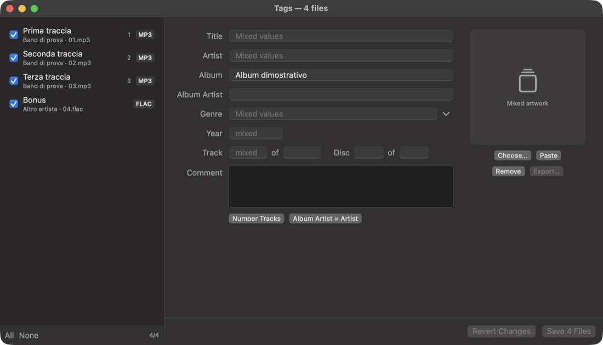

# Editor dei tag e vista copertina

## Editor dei tag (⌥⌘I)

Si apre da **File → Modifica tag…** o dal menu MISC della playlist, sui brani selezionati (o su quello in riproduzione).

- **Elenco a sinistra.** Ogni file ha una casella per includerlo o escluderlo, il numero di traccia e il formato. Il lucchetto indica i formati in sola lettura. L'ordine si cambia trascinando, e conta per "Numera le tracce".
- **Campi:** titolo, artista, album, artista album, genere (con un menu dei generi comuni), anno, traccia/totale, disco/totale, commento.
  - Con più file inclusi, un campo con valori diversi mostra "Valori diversi" e resta com'è se non lo tocchi.
  - Un valore scritto vale per tutti i file inclusi; un campo svuotato cancella il tag.
  - Un pallino indica i campi modificati.
- **Copertina:** anteprima con misura, formato e peso. Si cambia con Scegli…, Incolla o trascinandoci un'immagine; c'è anche Rimuovi ed Esporta…. JPEG e PNG restano come sono, gli altri formati diventano JPEG.
- **Strumenti per più file:**
  - **Numera le tracce:** 1…n nell'ordine dell'elenco, con il totale;
  - **Artista album = Artista**.
- **Salvataggio:** in background. Poi i tag vengono riletti dai file e la playlist, le copertine in cache e "In riproduzione" si aggiornano (`Ctl.tagsChanged`).

### Formati e scrittura (`TagIO.swift`)

| Formato | Tag | Come si scrive |
| --- | --- | --- |
| MP3 | ID3v2.3 o 2.4 (resta la versione del file) + ID3v1 se presente | Codice nostro. I frame non gestiti (TXXX, testi, ReplayGain…) restano. Il testo usa Latin-1 se basta, altrimenti UTF-16 (2.3) o UTF-8 (2.4) |
| FLAC | Vorbis comment + blocco PICTURE | Codice nostro. I commenti non gestiti e gli altri blocchi restano |
| M4A, M4B, MP4, AAC/ALAC in MP4 | Atomi iTunes | AVFoundation (`AVAssetExportSession` passthrough): l'audio viene ricopiato senza ricodifica |
| Ogg, Opus, APE, WavPack, WMA e altri | Sola lettura | — |

- **MP3 e FLAC:** se il nuovo tag sta nello spazio del vecchio (padding compreso), il file viene modificato sul posto senza riscriverlo. Altrimenti si scrive una copia con 2–4 KB di padding, che sostituisce l'originale con `replaceItemAt` (operazione atomica).
- **M4A:** si esporta sempre in un file temporaneo nella stessa cartella e poi si sostituisce.
- **Mappatura dei campi:**
  - ID3: `TIT2` titolo, `TPE1` artista, `TALB` album, `TPE2` artista album, `TYER`/`TDRC` anno, `TCON` genere, `TRCK`/`TPOS` traccia e disco "n/tot", `COMM` commento con descrizione vuota, `APIC` copertina di tipo 3;
  - Vorbis: `TITLE`, `ARTIST`, `ALBUM`, `ALBUMARTIST`, `DATE`, `GENRE`, `TRACKNUMBER`/`TRACKTOTAL`, `DISCNUMBER`/`DISCTOTAL`, `COMMENT`;
  - MP4: `©nam`, `©ART`, `©alb`, `aART`, `©day`, `©gen`, `trkn`, `disk`, `©cmt`, `covr`.

Test: `--test-tags` crea MP3 (2.3 con v1, 2.4), FLAC e M4A con un FFmpeg completo e verifica:
- scrittura e rilettura, con accenti ed emoji;
- campi e frame non toccati che restano;
- scrittura sul posto;
- audio identico (stesso numero di campioni);
- lettura indipendente con `ffprobe`;
- il modello dell'editor usato come dalla finestra.

## Ricerca online: MusicBrainz e Cover Art Archive

Il pulsante **Look Up Online…** dell'editor cerca l'album su [MusicBrainz](https://musicbrainz.org) partendo da album e artista dei file inclusi (`MusicBrainz.swift`).

- **Ricerca:** query Lucene con i campi `release` e `artist` (i caratteri speciali vengono protetti). Ogni risultato mostra data, paese, formato, numero di tracce e stato.
- **Associazione dei file:** per numero di disco e traccia se i file li hanno, altrimenti per ordine. I file in più o in meno vengono segnalati.
- **Cosa viene scritto:** titolo, artista, album, artista album, anno, traccia/totale, disco/totale, e la copertina frontale dal [Cover Art Archive](https://coverartarchive.org) (miniatura da 500 px). Si possono escludere i campi da non toccare. I tag non vengono salvati finché non si preme Salva.
- **Regole di MusicBrainz:** User-Agent descrittivo e al massimo una richiesta al secondo, rispettati per ogni chiamata. Un 503 viene ritentato una volta.

Test: `--test-musicbrainz` controlla escape delle query, associazione file/tracce e ricerche reali.

## Vista copertina (⌥⌘A)

**Vista → Copertina**:
- la copertina del brano in corso in grande, rimpicciolita in pausa come in Apple Music, con titolo, artista e album;
- barra di avanzamento trascinabile e comandi;
- in basso la striscia degli album della playlist: un clic fa partire l'album, al passaggio del mouse compaiono titolo, artista e numero di brani;
- lo sfondo è la copertina sfocata e respira con i bassi;
- doppio clic sulla copertina per lo schermo intero, Esc per uscire.

Codice: `AlbumArtView.swift` (`PlaylistAlbum` raggruppa gli album nell'ordine della playlist; i compilation vanno sotto "Artisti vari").
